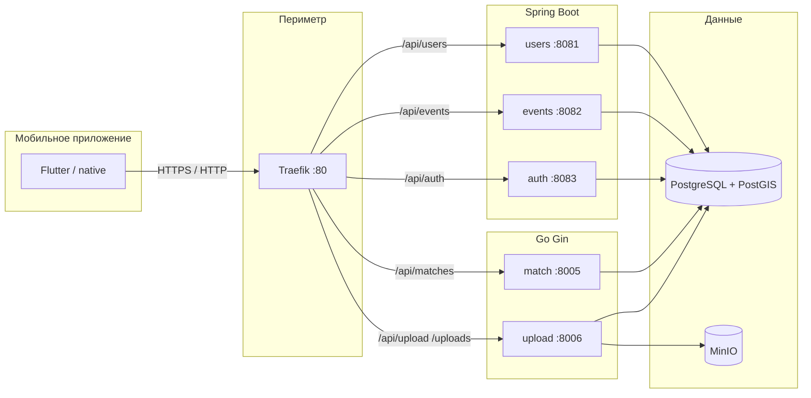
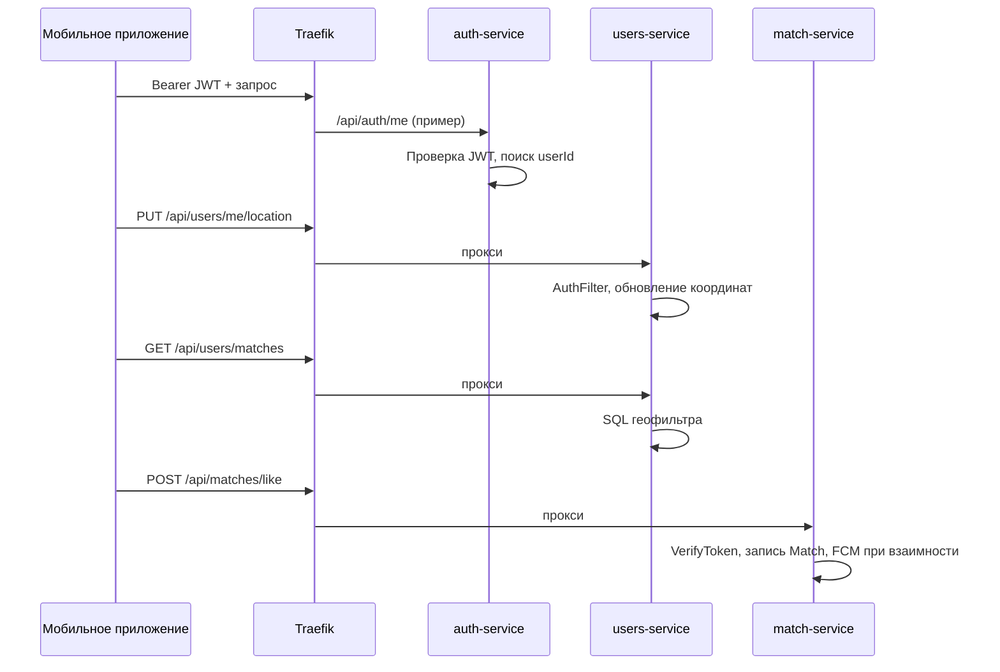

# Разработка серверной части мобильного приложения геолокационной социальной сети

**Проект в репозитории:** Andex Events (andexevents).  
**Назначение документа:** единый источник фактов по backend для **пояснительной записки**, **отчёта по практике** или **ВКР**: от предметной области и постановки задач до стеков, схем БД, API, безопасности и развёртывания. Ниже также сохранён **полный технический справочник** по коду и конфигам.

**Клиент:** мобильное приложение; типичный базовый URL API при локальном Traefik: **`http://localhost`** (порт **80**), пути **`/api/...`**.

---

## Оглавление

**Часть I — материалы для отчёта**

- [0. Как пользоваться документом при написании](#0-как-пользоваться-документом-при-написании)
- [1. Актуальность и проблема](#1-актуальность-и-проблема)
- [2. Объект и предмет разработки](#2-объект-и-предмет-разработки)
- [3. Цель и задачи](#3-цель-и-задачи)
- [4. Обзор предметной области и сопоставление с реализацией](#4-обзор-предметной-области-и-сопоставление-с-реализацией)
- [5. Требования к серверной части (извлечённые из проекта)](#5-требования-к-серверной-части-извлечённые-из-проекта)
- [6. Архитектурные решения и обоснование](#6-архитектурные-решения-и-обоснование)
- [7. Функциональные модули и доменная модель](#7-функциональные-модули-и-доменная-модель)
- [8. Геолокация и пространственные данные](#8-геолокация-и-пространственные-данные)
- [9. Безопасность, конфиденциальность и модерация](#9-безопасность-конфиденциальность-и-модерация)
- [10. Контроль качества, сборка, тестирование](#10-контроль-качества-сборка-тестирование)
- [11. Развёртывание и эксплуатация](#11-развёртывание-и-эксплуатация)
- [12. Ограничения, риски и направления развития](#12-ограничения-риски-и-направления-развития)
- [13. Шаблоны текстов для отчёта](#13-шаблоны-текстов-для-отчёта)
- [14. Рекомендуемая структура глав пояснительной записки](#14-рекомендуемая-структура-глав-пояснительной-записки)
- [15. Перечень иллюстраций и таблиц](#15-перечень-иллюстраций-и-таблиц)
- [16. Источники и документация (для списка литературы)](#16-источники-и-документация-для-списка-литературы)

**Часть II — технический справочник по репозиторию**

- [II.1. Стек и роли компонентов](#ii1-стек-и-роли-компонентов)
- [II.2. Расположение в репозитории](#ii2-расположение-в-репозитории)
- [II.3. Docker Compose](#ii3-docker-compose-отличия-файлов)
- [II.4. Traefik и health](#ii4-traefik-и-доступность-health)
- [II.5. База данных и миграции](#ii5-база-данных-и-миграции)
- [II.6. Аутентификация и авторизация](#ii6-аутентификация-и-авторизация)
- [II.7. Java-сервисы](#ii7-java-сервисы-порты-actuator-openapi)
- [II.8. Go: match-service](#ii8-go-match-service)
- [II.9. Go: upload-service](#ii9-go-upload-service)
- [II.10. Shared Firebase (Go)](#ii10-shared-sharedpkgfirebase)
- [II.11. Сборка и запуск](#ii11-сборка-и-запуск-из-репозитория)
- [II.12. Секреты и переменные окружения](#ii12-секреты-и-переменные-окружения-сводка)
- [II.13. Известные несостыковки](#ii13-известные-несостыковки-и-краевые-случаи)

---

# Часть I. Материалы для отчёта

## 0. Как пользоваться документом при написании

| Этап работы | Что читать |
|-------------|------------|
| Введение, актуальность, цель | разделы **1–3** |
| Обзор литературы / аналогов | **4**, **16** |
| Постановка задачи, требования | **5** |
| Проектирование | **6–7**, диаграммы в **6** |
| Реализация «ядра» (гео, события, мэтчи) | **7–8**, затем **Часть II** |
| Защита данных, безопасность | **9**, **II.6** |
| Тестирование, CI, сборка | **10**, **II.11** |
| Развёртывание | **11**, **II.3–II.4** |
| Заключение | **12–13** |
| Оформление Записки (оглавление, рисунки) | **14–15** |

Формулировки в Части I можно **перефразировать** под стиль вашего учебного заведения; числа, названия сервисов и путей лучше **сверять** с Частью II.

---

## 1. Актуальность и проблема

Мобильные **геолокационные социальные сервисы** объединяют учёт положения пользователя, социальное взаимодействие (профили, лайки, мэтчи, чаты вне scope backend-репо) и часто **событийность** (афиша, встречи рядом). Серверная часть должна обеспечивать:

- идентификацию пользователя с устройства;
- хранение и выдачу геопривязанного контента;
- масштабируемое разделение функций (медиа, тяжёлые сценарии, администрирование);
- модерацию и санкции для снижения токсичности и злоупотреблений.

**Проблема, решаемая в проекте:** спроектировать и реализовать **набор согласованных backend-сервисов** для приложения класса «знакомства + события рядом»: учётные записи и профили, обновление координат, подбор кандидатов в зоне интереса, отдельный сервис «свайпов» и взаимных мэтчей, геолокация событий (PostGIS), загрузка изображений, роли модератора/администратора.

---

## 2. Объект и предмет разработки

| Термин | Содержание в рамках отчёта |
|--------|----------------------------|
| **Объект разработки** | Серверная часть программного комплекса мобильного приложения геолокационной социальной сети (микросервисы, БД, шлюз, хранилище объектов). |
| **Предмет разработки** | Методы и средства построения REST API, распределения данных по схемам PostgreSQL, аутентификации по Firebase JWT, маршрутизации через Traefik, разделения логики между Java (Spring Boot) и Go (Gin). |

---

## 3. Цель и задачи

**Цель:** разработать серверную часть, обеспечивающую работу мобильного клиента в сценариях регистрации/профиля, геопоиска людей и событий, социального взаимодействия (мэтчи), загрузки медиа и модерации.

**Задачи (можно перенести в отчёт нумерованным списком):**

1. Проанализировать требования к геолокационной соцсети и сопоставить их с доменными областями системы.
2. Спроектировать **микросервисную** архитектуру с **API-шлюзом** и единой БД с логическим разделением схем.
3. Реализовать **аутентификацию** на основе **Firebase ID Token** и сопоставление токена с внутренним идентификатором пользователя.
4. Реализовать **обновление геопозиции** пользователя и **поиск кандидатов** в радиусе с учётом настроек приватности и блокировок.
5. Реализовать **события** с координатами и модерацией, участие, рейтинги, waitlist, check-in (см. API events-service).
6. Выделить **match-service** для действий LIKE/DISLIKE/SUPER_LIKE и взаимных мэтчей с уведомлениями (FCM).
7. Реализовать **загрузку файлов** в объектное хранилище (MinIO) и публичную выдачу по стабильным URL.
8. Обеспечить **контейнеризованное** развёртывание (Docker Compose), разделение dev/prod конфигураций.
9. Провести **тестирование** модулей (JUnit, Go `go test`, при необходимости интеграционные тесты с Testcontainers — см. parent POM).

---

## 4. Обзор предметной области и сопоставление с реализацией

Типичные функции геосоцсети | Реализация в Andex Events (где смотреть в коде)
---|---
Учётная запись / сессия с телефона | Firebase Auth на клиенте; сервер принимает **Bearer JWT**; `auth-service`, фильтры в Java, middleware в Go
Профиль, интересы, возрастные фильтры | `users-service`, таблица `users."User"`
Геопозиция пользователя | `PUT /api/users/me/location`, поля `lastLatitude`, `lastLongitude`, `lastLocationUpdate`
Лента кандидатов «рядом» | `GET /api/users/matches` — выборка по **bounding box** + фильтры видимости; реализация в `UserRepository.findMatches`
Приватность в ленте | миграция `V8__add_privacy_settings.sql`: `showInMatches`, `incognitoMode`, `showVisitedEvents`, `hideOnlineStatus`; участие в SQL ленты мэтчей
Взаимность «симпатий» | `match-service`, таблица `public."Match"`; push через FCM (`push_notifier`)
События на карте / рядом | `events-service`, в `V1__init` у события `latitude`, `longitude`, `locationGeo geography(Point,4326)`
UGC (фото) | `upload-service` + MinIO; связка URL с профилем в БД для `avatars` / `photos`
Безопасность сообщества | репорты, санкции пользователей и событий, баны участников, аудит админки — см. контроллеры users/events

---

## 5. Требования к серверной части (извлечённые из проекта)

### 5.1 Функциональные

- **F1.** Регистрация связки Firebase UID ↔ запись `users."User"` (`POST /api/users`).
- **F2.** Чтение/обновление профиля, онбординг, локация.
- **F3.** Геозависимая выдача кандидатов (`GET /api/users/matches`) с параметрами радиуса и лимита.
- **F4.** CRUD событий, участие, модерация, санкции, waitlist, check-in, рейтинги.
- **F5.** Действия мэтчинга и запросы взаимности (`/api/matches/*`).
- **F6.** Загрузка и выдача файлов (`/api/upload`, `/uploads/...`).
- **F7.** Модерация пользователей, репорты, роли ADMIN/MODERATOR, аудит.

### 5.2 Нефункциональные

- **NF1.** Развёртывание в Docker; горизонтальное масштабирование возможно за счёт stateless сервисов и внешней БД (детализация — тема будущей доработки).
- **NF2.** Разделение схем БД по сервисам для уменьшения связности миграций.
- **NF3.** Конфигурируемый режим «все запросы с токеном» для prod (`APP_AUTH_DEFAULTREQUIREAUTH`).
- **NF4.** Наблюдаемость базового уровня: Spring Actuator (`health`, `info`, `metrics`), `/health` в каждом сервисе.

---

## 6. Архитектурные решения и обоснование

**Почему микросервисы:** разные области (профили, афиша, файлы, real-time лайки) имеют разную частоту изменений и нагрузку; отдельный **match-service** на Go упрощает изоляцию сценария «свайпы» и работы с таблицей `Match` без раздувания монолита.

**Почему единая БД PostgreSQL:** транзакционная целостность между пользователями и событиями; **PostGIS** для пространственных типов у событий; общие FK (например `Match` → `users."User"`).

**Почему API-шлюз (Traefik):** единая точка входа для мобильного клиента (`/api/...`), TLS termination в проде может быть вынесен перед Traefik.

**Почему Firebase:** готовая аутентификация на клиенте; сервер только **верифицирует JWT** (Java: JWKS + RSA; Go: Admin SDK).





---

## 7. Функциональные модули и доменная модель

| Модуль | Сервис | Ключевые сущности / артефакты |
|--------|--------|-------------------------------|
| Идентификация | auth-service, users-service | JWT → `AuthContext`; `users."User"` |
| Профиль и приватность | users-service | `User`, миграции V1–V8 |
| Геолента знакомств | users-service | `GET /api/users/matches`, `UserRepository.findMatches` |
| Социальный граф (лайки) | match-service | `public."Match"`, enum `MatchAction` |
| События | events-service | `Event`, `Participant`, модерация, санкции |
| Медиа | upload-service, MinIO | бакеты `avatars`, `events`, `photos` |
| Модерация и доверие | users + events | reports, sanctions, bans, audit logs |

---

## 8. Геолокация и пространственные данные

### 8.1 Пользователь

- Координаты хранятся в **`users."User"`** (`lastLatitude`, `lastLongitude`, `lastLocationUpdate`).
- API **`PUT /api/users/me/location`** валидирует широту/долготу на контроллере.
- **`GET /api/users/matches`** принимает опциональные `latitude`, `longitude`; если не заданы — берутся координаты из профиля. Параметры **`radiusKm`** (по умолчанию 50) и **`limit`** (по умолчанию 20).
- Алгоритм в `UserRepository.findMatches`: построение **ограничивающего прямоугольника** (bounding box) вокруг точки на сфере (радиус Земли 6371 км), фильтрация по `lastLatitude`/`lastLongitude` в интервале, исключение самого себя, учёт **онбординга**, **видимости профиля**, **`showInMatches`**, **инкогнито** (с исключением для уже лайкнутых в таблице `Match`), **возрастных предпочтений** текущего пользователя, **блокировок**.

*Для отчёта можно отдельно описать погрешность bbox vs точный круг Haversine и обосновать выбор как компромисс производительности.*

### 8.2 События

- В схеме **`events`**: поля `latitude`, `longitude`, тип **`locationGeo geography(Point, 4326)`** — основа для пространственных запросов и картографических сценариев на клиенте/сервере.

### 8.3 Инфраструктура

- Образ **`postgis/postgis:16-3.4`**; расширения **`postgis`**, **`pgcrypto`** также создаются в Flyway init пользовательских схем.

---

## 9. Безопасность, конфиденциальность и модерация

- **Транспорт:** в отчёте укажите, что в production ожидается HTTPS (на уровне балансировщика или Traefik с сертификатами).
- **Аутентификация:** Bearer JWT; проверка подписи и `iss`/`aud` в Java; Go — Firebase Admin `VerifyIDToken`.
- **Авторизация:** роли в данных пользователя + явные проверки в контроллерах для админ-маршрутов.
- **Приватность:** флаги в БД (раздел 8.1); настройки видимости локации в модели пользователя (`isLocationVisible` в V1).
- **Модерация:** санкции, репорты, отзыв санкций, аудит — для раздела «снижение правовых и репутационных рисков».

---

## 10. Контроль качества, сборка, тестирование

- **Java:** `./mvnw test`, Testcontainers в parent POM (`DOCKER_HOST` для surefire).
- **Go:** `go test ./...` в `shared`, `match-service`, `upload-service` (см. Makefile).
- **Статический анализ:** в отчёте можно указать использование встроенных средств IDE + `go vet` / линтеры по политике команды.

---

## 11. Развёртывание и эксплуатация

- **Dev:** `docker-compose.yml` или `deployments/docker/docker-compose.yml` (предпочтительно второй, если нужны скрипты **`postgres-init`**).
- **Prod-подобный:** `docker-compose.prod.yml` с обязательными секретами через `:?`.
- **Секреты:** `FIREBASE_PROJECT_ID`, пароли БД/MinIO, файл **`secrets/firebase-service-account.json`** для Go.

---

## 12. Ограничения, риски и направления развития

Используйте как готовый список для подраздела «Недостатки и перспективы»:

- Корневой compose **без** `postgres-init` — риск отсутствия таблицы `Match` при «чистом» подъёме только из корня.
- **`/health`** не маршрутизируется через Traefik по умолчанию.
- Go CORS `*` + credentials — потенциальная проблема для webview.
- `DELETE /api/upload` не удаляет объект из MinIO — риск «осиротевших» файлов.
- Бакет **`media`** в MinIO не используется upload whitelist.
- Масштабирование match-service и устранение single-writer узких мест БД — тема дальнейшего исследования.

---

## 13. Шаблоны текстов для отчёта

### Аннотация (заполнить числами после замеров)

> В работе рассматривается разработка серверной части мобильного приложения геолокационной социальной сети. Реализован набор взаимосвязанных сервисов на платформах Spring Boot и Go, объединённых API-шлюзом Traefik и общей базой данных PostgreSQL с расширением PostGIS. Аутентификация пользователей выполняется по токенам Firebase. Описаны архитектура, ключевые модули (профиль, геопоиск, события, мэтчинг, медиа), средства развёртывания в Docker. Практическая значимость заключается в …

### Заключение (черновик)

> В ходе работы спроектирована и реализована серверная часть … На базе PostgreSQL и PostGIS обеспечено хранение геоданных пользователей и событий. Взаимодействие клиента с backend организовано через REST и единую точку входа. Достигнута модульность за счёт выделения сервисов … Направления развития: кэширование, rate limiting, шифрование соединений, доработка политики хранения медиа.

---

## 14. Рекомендуемая структура глав пояснительной записки

| Глава | Содержание | Откуда брать материал |
|-------|------------|------------------------|
| Введение | актуальность, цель, задачи | I.1–I.3 |
| Анализ предметной области | аналоги, требования | I.4–I.5, литература |
| Проектирование | архитектура, БД, API | I.6–I.8, II.5–II.7 |
| Реализация | стек, сервисы, ключевые алгоритмы | II целиком, I.8 |
| Безопасность | | I.9, II.6 |
| Тестирование и развёртывание | | I.10–I.11, II.11–II.12 |
| Заключение | | I.12–I.13 |

---

## 15. Перечень иллюстраций и таблиц

**Рисунки (рекомендуемые):** архитектура (рис. из mermaid §6), диаграмма последовательности запроса с JWT (§6), ER-диаграмма схем `users` / `events` / `public` (по миграциям), скрин Swagger одного из сервисов.

**Таблицы:** сопоставление функций предметной области с endpoint (I.4), матрица «сервис — порт — префикс Traefik» (II.1–II.3), таблица переменных окружения (II.12).

---

## 16. Источники и документация (для списка литературы)

1. Spring Boot — https://spring.io/projects/spring-boot  
2. Spring Boot 3.3.x reference — https://docs.spring.io/spring-boot/docs/current/reference/htmlsingle/  
3. PostgreSQL Documentation — https://www.postgresql.org/docs/  
4. PostGIS — https://postgis.net/documentation/  
5. Traefik v3 (Docker provider) — https://doc.traefik.io/traefik/  
6. Firebase Authentication (ID tokens) — https://firebase.google.com/docs/auth  
7. Docker Compose specification — https://docs.docker.com/compose/compose-file/  
8. MinIO Documentation — https://min.io/docs/minio/linux/index.html  
9. Gin Web Framework — https://gin-gonic.com/docs/  
10. OWASP API Security Top 10 — https://owasp.org/www-project-api-security/  

---

# Часть II. Технический справочник по репозиторию

Документ **самодостаточный** по технике: сведения из исходников (`services-java`, `services`, `shared`, compose-файлы).

## II.1. Стек и роли компонентов

| Компонент | Технология / версия (из репо) | Назначение |
|-----------|-------------------------------|------------|
| API-шлюз | Traefik (Docker provider), entrypoint **:80** | Маршрутизация по префиксу пути к контейнерам сервисов |
| Users | Spring Boot **3.3.5**, Java **21**, Maven | Профили, модерация пользователей, фото, блокировки, репорты, гео-мэтчи в ленте |
| Events | То же | События, участие, модерация, санкции, waitlist, check-in, рейтинги; часть API блокировок живёт здесь |
| Auth | То же | Минимальный сервис: проверка токена и отдача `uid` / `userId` |
| Match | Go, Gin, pgxpool, zap | Лайки/дизлайки/суперлайк, взаимные мэтчи, входящие лайки; таблица **`public."Match"`** |
| Upload | Go, Gin, MinIO SDK, pgxpool | Multipart загрузка в MinIO, публичная выдача файлов по **`/uploads/...`** |
| Общий Go-код | `shared/pkg/firebase` | Firebase Admin: `VerifyIDToken`, FCM |
| БД | PostgreSQL **16** + PostGIS **3.4** (`postgis/postgis:16-3.4`) | Одна БД, схемы **`users`**, **`events`**, **`auth`** + `public` для мэтчей |
| Объектное хранилище | MinIO | Бакеты **`avatars`**, **`events`**, **`photos`**, **`media`** (создаётся init-контейнером) |
| Redis | `redis:7-alpine` | Есть в **dev** compose; в **`docker-compose.prod.yml`** сервис **не объявлен** |
| Аутентификация | Firebase **ID Token** | Заголовок **`Authorization: Bearer <JWT>`**; Java — JWKS (Auth0 JWT lib); Go — Firebase Admin SDK |

## II.2. Расположение в репозитории

| Путь | Содержимое |
|------|------------|
| `services-java/pom.xml` | Parent POM: модули `users-service`, `events-service`, `auth-service`; Flyway **10.10.0**; Testcontainers BOM |
| `services-java/users-service/` | Spring Boot, Flyway в `src/main/resources/db/migration/`, порт по умолчанию **8081** |
| `services-java/events-service/` | Порт **8082** |
| `services-java/auth-service/` | Порт **8083** |
| `services/match-service/` | Go, `cmd/main.go` |
| `services/upload-service/` | Go, `cmd/main.go`, `cmd/migrate/main.go` |
| `shared/pkg/firebase/` | Клиент Firebase для Go |
| `deployments/docker/docker-compose.yml` | Контексты `../../…`, **монтирует** `./postgres-init` |
| `docker-compose.yml` (корень) | Полный стек; **не монтирует** `postgres-init` |
| `docker-compose.prod.yml` | Prod-подобный compose |
| `deployments/docker/postgres-init/` | SQL при первом создании тома Postgres |
| `secrets/firebase-service-account.json` | **Не коммитится**; для Go монтируется как `/app/firebase-credentials.json` |

## II.3. Docker Compose: отличия файлов

### II.3.1. Общее для сервисов приложения

| Сервис | PathPrefix (Traefik) | Внутренний порт |
|--------|----------------------|-----------------|
| users-service | `/api/users` | 8081 |
| events-service | `/api/events` | 8082 |
| auth-service | `/api/auth` | 8083 |
| match-service | `/api/matches` | 8005 |
| upload-service | `/api/upload` **или** `/uploads` | 8006 |

Клиент: `http://localhost/api/users/...` — Traefik проксирует **без strip префикса**.

### II.3.2. `deployments/docker/docker-compose.yml`

- Postgres: **`andexevents` / andexevents_dev_password / andexevents`**, порт **5432**, volume **`./postgres-init:/docker-entrypoint-initdb.d`**.
- MinIO: **9000**, **9001**; пользователь **`andexevents`**, пароль **`andexevents_minio_secret`**.
- **minio-init**: бакеты `avatars`, `events`, `photos`, `media`.
- **Redis**: **6379**.
- **Traefik**: только **:80**; без `--api.insecure`.
- Java: `FIREBASE_PROJECT_ID`, `FIREBASE_JWKS_URL`, `FLYWAY_ENABLED`.
- Go: volume **`../../secrets/firebase-service-account.json` → `/app/firebase-credentials.json`**; `UPLOADS_PUBLIC_BASE_URL` (default `http://localhost`).

### II.3.3. Корневой `docker-compose.yml`

- Контекст Java: **`./services-java`**.
- Traefik: **`--api.insecure=true`**, порты **80** и **8080**.
- Postgres **без** `postgres-init`.

### II.3.4. `docker-compose.prod.yml`

- Обязательные env: `POSTGRES_PASSWORD`, `MINIO_ROOT_USER`, `MINIO_ROOT_PASSWORD`, …
- Java: **`APP_AUTH_DEFAULTREQUIREAUTH: "true"`**, **`APP_CORS_ALLOWEDORIGINPATTERNS`** из **`CORS_ALLOWED_ORIGIN_PATTERNS`**.
- Без проброса портов приложений наружу (только Traefik **80**).
- **Redis** отсутствует; Postgres **без** `postgres-init` в файле.

## II.4. Traefik и доступность health

- Маршруты: **`/api/...`**, **`/uploads`**.
- **`GET /health`** на сервисах **не** обязательно доступен через `http://localhost/health` — используйте прямой порт (`:8081` … `:8006`) или добавьте router.

## II.5. База данных и миграции

### II.5.1. Одна БД, несколько схем

- БД: **`andexevents`**.
- JPA default schema: **`users`**, **`events`**, **`auth`**.
- Flyway: `create-schemas: true`, `schemas` + `default-schema` в каждом `application.yml`.

### II.5.2. `deployments/docker/postgres-init/`

**`00-extensions.sql`:** `postgis`, `pgcrypto`, схемы `users`, `events`, `auth`.

**`01-match-table.sql`:** enum **`"MatchAction"`** (`LIKE`, `DISLIKE`, `SUPER_LIKE`); таблица **`public."Match"`** с FK на **`users."User"("id")`**, уникальность пары пользователей в разрезе `eventId`.

### II.5.3. Flyway: users-service

| Файл | Смысл |
|------|--------|
| `V1__init.sql` | `users."User"`, `UserRole`, координаты, видимость, `maxDistance`, FCM |
| `V2__firebase_uid.sql` | Firebase UID |
| `V3__add_reports.sql` | Жалобы |
| `V4__add_photos.sql` | Фото |
| `V5__add_cover_and_blocks.sql` | Обложка, блокировки |
| `V6__add_admin_audit_logs.sql` | Аудит |
| `V7__add_user_sanctions.sql` | Санкции |
| `V8__add_privacy_settings.sql` | `showVisitedEvents`, `showInMatches`, `incognitoMode`, `hideOnlineStatus` |

### II.5.4. Flyway: events-service

| Файл | Смысл |
|------|--------|
| `V1__init.sql` | `Event`, `Participant`, `locationGeo` |
| `V2`–`V6` | Firebase, картинки, рейтинги, санкции, управление участниками |

### II.5.5. Flyway: auth-service

- **`FLYWAY_ENABLED`**: по умолчанию **`false`**.
- `V1__init.sql`: `GRANT USAGE ON SCHEMA users TO CURRENT_USER;`

### II.5.6. MinIO и upload-service

**`AllowedBucket`:** только **`avatars`**, **`events`**, **`photos`**. Бакет **`media`** в API загрузки не используется.

## II.6. Аутентификация и авторизация

### II.6.1. Java: `FirebaseJwtVerifier`

- Обязателен **`FIREBASE_PROJECT_ID`**.
- JWKS: **`FIREBASE_JWKS_URL`** или **`https://www.googleapis.com/service_accounts/v1/jwk/securetoken@system.gserviceaccount.com`**.
- Проверка: **RSA256**, issuer **`https://securetoken.google.com/<projectId>`**, audience **`<projectId>`**.

### II.6.2. Java: `AuthFilter` и `APP_AUTH_DEFAULTREQUIREAUTH`

| Сервис | `false` | `true` (prod compose) |
|--------|---------|------------------------|
| **users-service** | Фильтр только для **`requiredPaths`** | Всё, кроме `publicPaths` + `/health`, `/actuator/**`, `/swagger-ui/**`, `/v3/api-docs/**` |
| **auth-service** | Аналогично | Аналогично |
| **events-service** | Фильтр для `requiredPaths` и `optionalPaths` (на optional токен не обязателен) | Публичны: `publicPaths` ∪ `optionalPaths` ∪ health/swagger; остальное — Bearer. Шаблон `GET /api/events/*` **одним сегментом** не покрывает `GET /api/events/user/{id}` — в режиме `true` нужен токен на уровне фильтра |

Атрибут запроса: **`andex.auth`** → **`AuthContext(uid, email, userId)`**.

### II.6.3. Списки `requiredPaths` / `optionalPaths`

**auth-service — required:** `GET /api/auth/me`, `POST /api/auth/validate`.

**users-service — required:** `POST/GET /api/users`, `PUT /api/users/*/role`, admin audit/sanctions, `GET/PUT` me*, onboarding, location, `GET /api/users/matches`, photos, blocks, reports.

**events-service — required:** CRUD событий, participate, moderation, sanctions, participants manage, bans, waitlist, checkin, `/api/users/blocks*`, ratings.

**events-service — optional:** `GET /api/events`, `GET /api/events/*`, `GET /api/events/*/rating/stats`.

### II.6.4. Go: match-service

- **`AuthMiddleware`**: Bearer; **`VerifyToken`**; **`dbUserID`** из `users."User"` по `firebaseUid` или `supabaseUid`.
- **`FIREBASE_CREDENTIALS_FILE`** обязателен.

### II.6.5. Go: upload-service

- **`FirebaseAuthMiddleware`** на **`/api/upload`**; маппинг UID → `dbUserID` обязателен.
- Публично: **`GET /health`**, **`GET /uploads/...`**.

## II.7. Java-сервисы: порты, Actuator, OpenAPI

- **Actuator:** `health`, `info`, `metrics`.
- **springdoc:** `/v3/api-docs`, `/swagger-ui`.
- **Datasource:** env Spring или localhost defaults.
- **CORS:** `APP_CORS_ALLOWEDORIGINPATTERNS` или localhost-паттерны.

### II.7.1. Формат ответов

**`ApiResponse`**: `success`, `data`, `message`.

### II.7.2. auth-service (**8083**)

| Метод | Путь |
|-------|------|
| GET | `/api/auth/me` |
| POST | `/api/auth/validate` |
| GET | `/health` |

### II.7.3. users-service (**8081**)

Префиксы: **`/api/users`**, **`/api/users/reports`**.

**`UserController`:**

| Метод | Путь | Заметки |
|-------|------|---------|
| GET | `/api/users` | Список для модерации; проверка роли admin/moder |
| GET | `/api/users/admin/audit-logs?limit=` | Аудит (default limit 100) |
| GET | `/api/users/admin/sanctions` | Query `targetUserId` опционально |
| POST | `/api/users/admin/sanctions` | Тело `CreateSanctionRequest` |
| PUT | `/api/users/admin/sanctions/{sanctionId}/revoke` | Отзыв санкции |
| PUT | `/api/users/{id}/role` | Смена роли (не себе) |
| POST | `/api/users` | Создание пользователя: uid+email в токене + body `displayName`, `photoUrl` |
| GET | `/api/users/me` | Текущий профиль |
| GET | `/api/users/me/sanctions` | Санкции на себя |
| GET | `/api/users/{id}` | Публичный профиль (**не** в `requiredPaths` — в dev без обязательного Bearer на фильтре) |
| POST | `/api/users/me/onboarding` | Завершение онбординга |
| PUT | `/api/users/me` | Обновление профиля |
| PUT | `/api/users/me/location` | Координаты |
| GET | `/api/users/matches` | Query: `latitude`, `longitude`, `radiusKm` (default 50), `limit` (default 20) |
| POST | `/api/users/me/photos` | Body: URL фото |
| DELETE | `/api/users/me/photos` | Body: `photoUrl` |
| POST | `/api/users/me/blocks` | Body: `targetUserId` |
| DELETE | `/api/users/me/blocks` | Body: `targetUserId` |

**`ReportController`** (`/api/users/reports`):

| Метод | Путь |
|-------|------|
| POST | `/api/users/reports` |
| GET | `/api/users/reports` |
| GET | `/api/users/reports/events` |
| PUT | `/api/users/reports/{reportId}` |

**`HealthController`:** `GET /health`.

### II.7.4. events-service (**8082**)

**`EventController`** (`@RequestMapping("/api/events")`):

| Метод | Путь |
|-------|------|
| POST | `/api/events` |
| GET | `/api/events` |
| GET | `/api/events/moderation/all` |
| GET | `/api/events/user/{userId}` |
| GET | `/api/events/user/{userId}/participated` |
| GET | `/api/events/{id}` |
| PUT | `/api/events/{id}` |
| DELETE | `/api/events/{id}` |
| POST | `/api/events/{id}/participate` |
| DELETE | `/api/events/{id}/participate` |
| GET | `/api/events/{id}/participants` |
| POST | `/api/events/{id}/rating` |
| GET | `/api/events/{id}/rating/stats` |
| GET | `/api/events/{id}/rating/reviews` |
| GET | `/api/events/user/{userId}/rating` |

**`EventSanctionController`:** `/api/events` — `POST/GET .../{eventId}/sanctions`, `PUT .../sanctions/{sanctionId}/revoke`.

**`WaitlistController`:** `GET/PUT /api/events/{eventId}/waitlist...`.

**`EventParticipantManagementController`:** `GET .../participants/manage`, `DELETE .../participants/{userId}`, `POST/DELETE .../bans...`, `PUT .../checkin/{userId}`.

**`OrganizerBlockController`:** `@RequestMapping("/api/users/blocks")` — `POST`, `GET`, `DELETE /{blockedUserId}` (код в **events-service**).

**`HealthController`:** `GET /health`.

## II.8. Go: match-service

| Env | Default |
|-----|---------|
| `PORT` | 8005 |
| `ENVIRONMENT` | development |
| `DB_*` | см. `internal/config/config.go` |
| `FIREBASE_CREDENTIALS_FILE` | в compose задан |

**API:** `GET /health`; группа **`/api/matches`**: `GET ""`, `GET /actions`, `GET /incoming-likes`, `POST /like|/dislike|/super-like` с JSON `{ "targetUserId", "eventId?" }`, query `limit` 1–200, `action` для actions.

**CORS:** `AllowOrigins: *`, `AllowCredentials: true`.

**FCM:** `push_notifier` при взаимном мэтче.

## II.9. Go: upload-service

| Env | Default |
|-----|---------|
| `PORT` | 8006 |
| `DB_SSL_MODE` | disable |
| `MINIO_*` | см. config |
| `UPLOADS_PUBLIC_BASE_URL` | пусто → URL из forwarded headers |

**POST `/api/upload`:** multipart **`file`**, query **`bucket`** (`avatars`|`events`|`photos`), лимиты 5MB / 10MB, расширения jpg/png/gif/webp.

**DELETE `/api/upload`:** query `url`, `bucket` (default `photos`) — правка БД, не MinIO.

**GET `/uploads/:bucket/:userId/:filename`:** публично, regexp валидация пути.

## II.10. Shared: `shared/pkg/firebase`

`NewClient`, `VerifyToken`, FCM `SendPushNotification` / `SendMulticast`.

## II.11. Сборка и запуск из репозитория

```bash
cd services-java && ./mvnw clean package && ./mvnw test
cd services/match-service && go test ./... && go build -o match-service ./cmd/main.go
cd services/upload-service && go test ./... && go build -o upload-service ./cmd/main.go
```

**Makefile:** `make dev-up`, `build-go`, `build-java`, `test-go`, `test-java`, `docker-up`.

**Полный стек с init SQL:**

```bash
cd deployments/docker
docker compose up -d postgres redis minio minio-init traefik users-service events-service auth-service match-service upload-service
```

## II.12. Секреты и переменные окружения (сводка)

| Назначение | Переменная / файл |
|------------|-------------------|
| Firebase (Java) | `FIREBASE_PROJECT_ID`, `FIREBASE_JWKS_URL` |
| Строгая авторизация | `APP_AUTH_DEFAULTREQUIREAUTH` |
| CORS | `APP_CORS_ALLOWEDORIGINPATTERNS` / `CORS_ALLOWED_ORIGIN_PATTERNS` |
| Flyway | `FLYWAY_ENABLED` |
| Go Firebase | `FIREBASE_CREDENTIALS_FILE`, volume **`secrets/firebase-service-account.json`** |
| Публичные URL файлов | `UPLOADS_PUBLIC_BASE_URL` |
| Prod | `POSTGRES_*`, `MINIO_ROOT_*` |

## II.13. Известные несостыковки и краевые случаи

1. Корневой **`docker-compose.yml`** без **`postgres-init`**.
2. Traefik не проксирует **`/health`** по умолчанию.
3. MinIO **`media`** не в whitelist upload-service.
4. Go CORS `*` + credentials.
5. **`DELETE /api/upload`** не удаляет объект в MinIO.

---

*Часть II отражает состояние репозитория на момент обновления документа; при изменении кода сверяйтесь с исходниками.*
