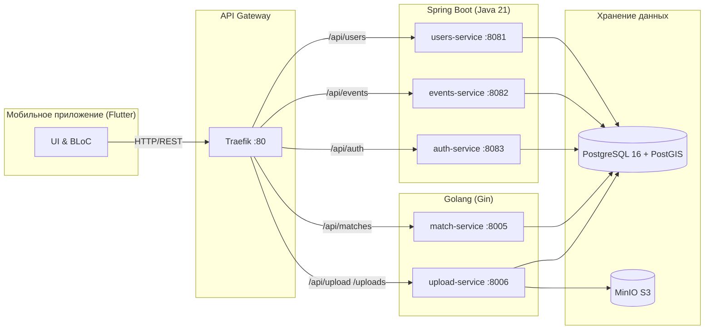

# Совокупные контекстные материалы для написания диплома по проекту Andex Events

Этот файл содержит весь собранный, структурированный и подготовленный контекст по проекту Andex Events для прямого использования в виде ВКР, курсовой работы или диплома. Он разбит на логические главы.

---

## 1. Введение и обзор предметной области

### 1.1 Актуальность и проблема
Мобильные **геолокационные социальные сервисы** объединяют учёт пространственного положения пользователя, социальное взаимодействие (создание профилей, механизм "лайков" и "взаимных совпадений", встроенные чаты) и часто **событийность** (афиша локальных мероприятий, встречи рядом). 

Серверная часть для такого приложения должна обеспечивать:
- Надежную идентификацию пользователя с устройства.
- Хранение, индексацию и выдачу геопривязанного контента с учетом кривизны земли.
- Масштабируемое разделение функций (медиа, тяжелые транзакции, социальные взаимодействия).
- Эффективную модерацию и санкционирование пользователей для снижения токсичности комьюнити.

**Проблема, решаемая в проекте:** спроектировать и реализовать **набор распределенных backend-сервисов** (мобильное приложение класса «знакомства + события рядом»), способных обрабатывать учетные записи, обновление координат, подбор кандидатов в зоне интереса алгоритмом свайпов, и предоставлять афишу событий, опираясь на высокопроизводительную реализацию с защитой данных.

### 1.2 Объект и предмет разработки
- **Объект разработки:** Серверная часть программного комплекса мобильного приложения геолокационной социальной сети и само мобильное приложение.
- **Предмет разработки:** Методы и средства построения REST API микросервисов, распределения данных по изолированным схемам PostgreSQL, механизмы аутентификации JWT и маршрутизация метрик и запросов API-шлюзом.

### 1.3 Цель и задачи
**Цель:** разработка серверной части, обеспечивающей работу мобильного клиента в сценариях регистрации, профилирования, геопоиска людей и мероприятий, социального взаимодействия (мэтчи), безопасной загрузки медиа-контента и модерации.

**Задачи:**
1. Проанализировать требования к геолокационной соцсети. 
2. Спроектировать микросервисную архитектуру с API-шлюзом и единой БД с логическим разделением схем.
3. Реализовать аутентификацию на основе провайдера Firebase ID Token.
4. Разработать алгоритм обновления геопозиции пользователя и подбор рекомендаций в радиусе (PostGIS).
5. Разработать функционал CRUD-взаимодействия с событиями (чек-ины, локации, роли).
6. Выделить независимый сервис `match-service` для высокочастотных действий свайпов (LIKE/DISLIKE) и нотификаций.
7. Интегрировать объектное хранилище (S3/MinIO) для безопасной и изолированной выдачи контента.
8. Обеспечить контейнеризованное развертывание компонентов (Docker).

---

## 2. Архитектура системы и выбор стека технологий

### 2.1 Стек технологий
Стек был выбран исходя из задачи построения отказоустойчивой, современной распределенной системы:
*   **Mobile (Мобильный клиент):** Flutter (Dart SDK ^3.9.2). Выбран как ведущий кроссплатформенный фреймворк для iOS и Android. Паттерн — BLoC (Business Logic Component).
*   **Backend (Java):** Приложение построено на Java 21 со Spring Boot 3.3.5. Инструмент миграции — Flyway.
*   **Backend (Golang):** Для задач, требующих высокой конкурентной производительности (мэтчи и стриминг файлов), использован Go 1.23+ с фреймворком Gin.
*   **База данных:** PostgreSQL 16 с подключенным расширением PostGIS (необходимо для пространственных "geography" гео-индексов).
*   **Хранилище объектов:** MinIO S3 (полностью совместимое API с Amazon S3) для статики и медиа-контента.
*   **Кэширование и сессии:** Redis 7.
*   **API-Шлюз:** Traefik v3.0, реализующий маршрутизацию и проксирование (Reverse Proxy) через порт 80.
*   **Auth:** Firebase Authentication. Безопасность инфраструктуры и JWKS валидация.

### 2.2 Разделение на микросервисы
Архитектура проекта разделена на набор согласованных микросервисов:

1.  **Traefik API Gateway:** Единая точка входа. Все запросы уходят на него (пример: `http://localhost/api/...`) и прозрачно маршрутизируются на порты сервисов.
2.  **auth-service (Java, Port 8083):** JWT validation gateway. Верифицирует токены Firebase, резолвит внутренние идентификаторы БД. Сам сервис без сохранения состояния (Stateless).
3.  **users-service (Java, Port 8081):** Управление пользователями, их профилями, координатами и запросами ленты рекомендаций мэтчей.
4.  **events-service (Java, Port 8082):** Запросы на создание и геолокационный поиск событий на карте.
5.  **match-service (Go, Port 8005):** Сервис обработки свайпов и фиксации взаимных симпатий.
6.  **upload-service (Go, Port 8006):** Работа с бинарниками. Загрузка в S3/MinIO.

### 2.3 Схема архитектуры в формате UML/Mermaid


---

## 3. Проектирование Базы Данных (Схемы и структуры)

В системе используется паттерн **Single Database, Multiple Schemas**. В едином физическом инстансе находятся разные схемы под разные сервисы. Общие расширения находятся в схеме `public`. 
Каждый Java-сервис сам следит за своими миграциями (Flyway).

- `users` schema — Таблица `"User"`.
- `events` schema — Таблицы `"Event"`, `"Participant"`.

Главное преимущество — использование пространственных типов `geography(Point, 4326)` расширения **PostGIS**. Это дает возможность осуществлять выборку из БД с помощью методов расчета радиального удаления (расстояние в метрах по геосфере земли), а не обычными Декартовыми координатами (Bounding Box). 

### 3.1 Основная таблица "User"
Определяет пользователя приложения:
```sql
CREATE TABLE "User" (
    id UUID PRIMARY KEY DEFAULT uuid_generate_v4(),
    "supabaseUid" VARCHAR(255) UNIQUE NOT NULL,
    email VARCHAR(255) UNIQUE NOT NULL,
    "displayName" VARCHAR(100),
    "photoUrl" TEXT,
    bio TEXT,
    interests TEXT[] DEFAULT '{}',
    "socialLinks" JSONB,
    age INTEGER CHECK (age >= 18 AND age <= 100),
    gender VARCHAR(50),
    role "UserRole" DEFAULT 'USER',
    
    "lastLatitude" DOUBLE PRECISION CHECK ("lastLatitude" >= -90 AND "lastLatitude" <= 90),
    "lastLongitude" DOUBLE PRECISION CHECK ("lastLongitude" >= -180 AND "lastLongitude" <= 180),
    "lastLocationUpdate" TIMESTAMP WITH TIME ZONE,
    
    "isProfileVisible" BOOLEAN DEFAULT TRUE,
    "isLocationVisible" BOOLEAN DEFAULT TRUE,
    "minAge" INTEGER,
    "maxAge" INTEGER,
    "maxDistance" INTEGER DEFAULT 50000,
    
    "isOnboardingCompleted" BOOLEAN DEFAULT FALSE,
    "createdAt" TIMESTAMP WITH TIME ZONE DEFAULT NOW(),
    "updatedAt" TIMESTAMP WITH TIME ZONE DEFAULT NOW()
);

-- Индекс для высоконагруженной выборки ленты
CREATE INDEX "User_lastLatitude_lastLongitude_idx" 
    ON "User"("lastLatitude", "lastLongitude")
    WHERE "isOnboardingCompleted" = TRUE AND "isProfileVisible" = TRUE;
```

---

## 4. Аутентификация, Ролевая модель и Безопасность

Проект реализует механизм **stateless bearer token** валидации. Сама аутентификация делегирована провайдеру Firebase. 
Жизненный цикл защиты API:
1. Мобильный клиент производит вход (соц.сети/email+пароль) на уровне Firebase SDK.
2. Клиент, с помощью провайдера состояния `IdTokenProvider`, получает временный JSON Web Token (ID Token).
3. Токен подкладывается к каждому запросу в заголовок `Authorization: Bearer <token>`.
4. Traefik доставляет запрос к сервису назначения, где настроены фильтры Java Spring Security (или middleware в Go).
5. На уровне конфигурации, Java-бэкенд скачивает публичные ключи подписи Google (JWKS endpoint) и криптографически верифицирует данные, извлекая `uid` пользователя.

В базе введена сущность `UserRole` со значениями `USER`, `MODERATOR`, `ADMIN`. Это используется на бэкенде для Spring аннотаций, таких как `@PreAuthorize("hasRole('ADMIN')")`, блокируя модераторские действия. 

Также реализованы Privacy-функции: пользователи могут скрывать онлайн, выставлять радиус поиска и уходить в инкогнито-режим (столбец `isProfileVisible`), что на уровне SQL отсеивает их из поисковых выборок других людей.

---

## 5. Обзор конечных точек REST API

Архитектура API спроектирована по парадигмам REST с возвратом стандартного Response-объекта (успешность, данные, сообщение об ошибке):
```json
{
  "success": true,
  "data": { ... },
  "message": null
}
```

Некоторые ключевые точки API:

**Пользователи (`/api/users`):**
- `POST /api/users` — Создание профиля
- `GET /api/users/me` — Получение собственного профиля
- `PUT /api/users/me/location` — Обновление координат (координаты: latitude, longitude).
- `GET /api/users/matches?maxDistance=5000&limit=10` — Алгоритмический расчет и вывод потенциальных кандидатов вокруг пользователя.

**События (`/api/events`):**
- `POST /api/events` — Создание нового события на карте. Передаются title, latitude, longitude, дата.
- `GET /api/events?latitude=X&longitude=Y&maxDistance=R` — PostGIS гео-поиск афиши.
- `POST /api/events/{id}/participate` — Присоединение к мероприятию.

**Мэтчинг и свайпы (Go `match-service`):**
- `POST /api/matches/like`, `POST /api/matches/dislike` — Свайп пользователя.
- В случае, если оба пользователя вызывают метод `/like` с указанием друг друга, генерируется сущность "Mutual Match" и отправляются push-уведомления (FCM).

**Управление файлами (Go `upload-service`):**
- `POST /api/upload?bucket=avatars` — Загрузка мультиформатного объекта Multipart. Формирует валидацию и напрямую отправляет потоком в MinIO, отдавая публичный URL.

---

## 6. Docker и Инфраструктура развёртывания

Описанная микросервисная архитектура полностью контейнеризирована инструментами Docker Compose. Для продуктивной и локальной (dev) среды написан `docker-compose.yml`, оркестрирующий:
1. Запуск БД PostgreSQL с накатом PostGIS.
2. Временное хранилище Redis.
3. Локальный или продакшн инстанс MinIO S3 сервера хранения.
4. Traefik, как Edge-роутер.
5. Горячий старт 3x Java-сервисов и 2x Go-сервисов.
Для обеспечения автоматизации был внедрен `Makefile`, который описывает команды типа `make build-java`, `make up` и позволяет управлять окружением из одной точки входа разработчика. Секреты (API Keys Яндекса, Firebase Service Accounts) вынесены в файлы окружения, которые строго игнорируются системой контроля версий (Git). 

---

## 7. Разработка клиентской части (Flutter)

Мобильное приложение (находится в каталоге `lib/`) создано с использованием методологии чистой архитектуры. 
Ключевые решения:
- **Менеджмент состояния:** Использование паттерна BLoC (Business Logic Component). Это отделяет состояние приложения (State) и потоки событий (Events) от пользовательского интерфейса (Widget), обеспечивая декларативный и тестируемый код.
- **Слои абстракции:** 
  - Папка `data/` содержит модели (парсинг JSON через Equatable) и API-сервисы.
  - Папка `core/` управляет конфигурацией, роутером, Firebase Auth.
  - Папка `presentation/` содержит UI экраны (`profile`, `home`, `events` и тд).
- **Карты:** Для визуализации объектов на картографии была использована интеграция с Yandex MapKit (адаптированная версия для Flutter). Ключи передаются методом `--dart-define` во время билда CI/CD или скрипта запуска. 
- Центральный подход HTTP: приложение не использует Dio для простых запросов, а напрямую взаимодействует через классический пакет `http` с обертками логирования.