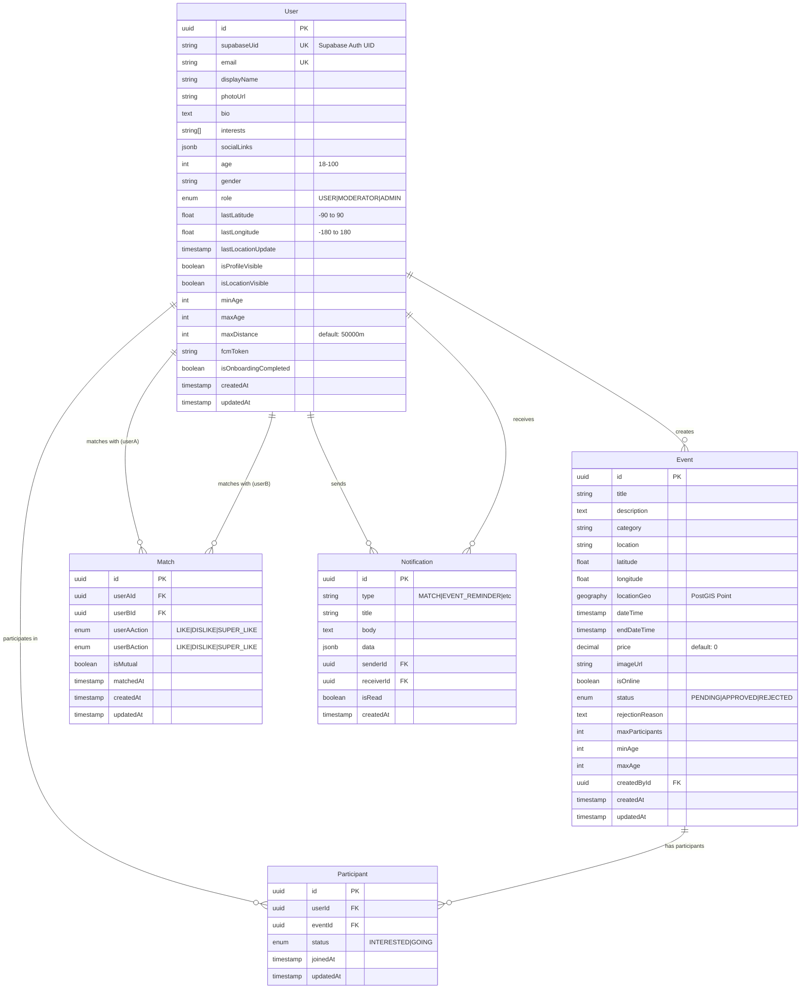
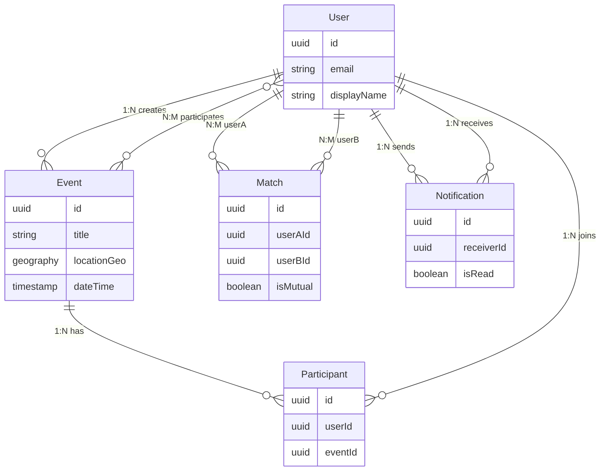
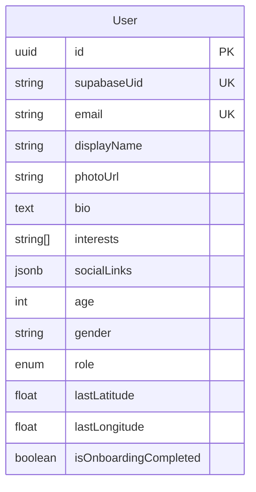
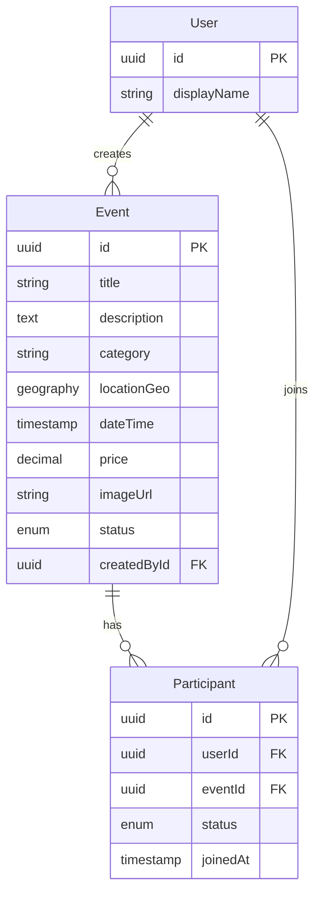
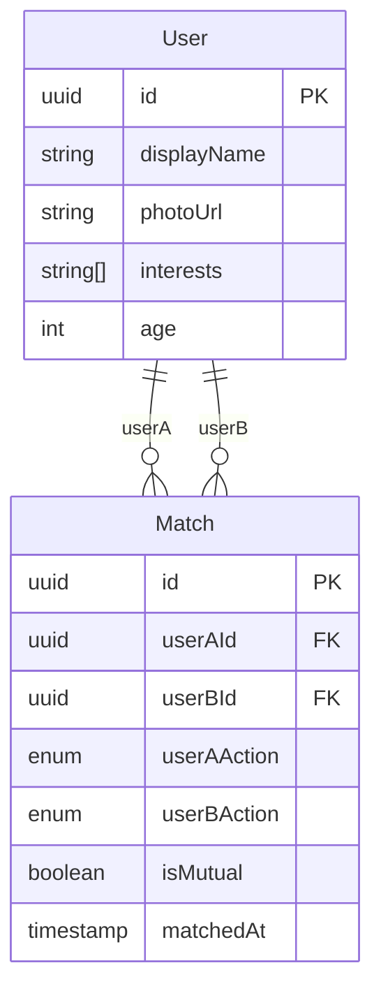
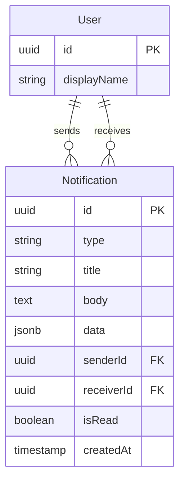
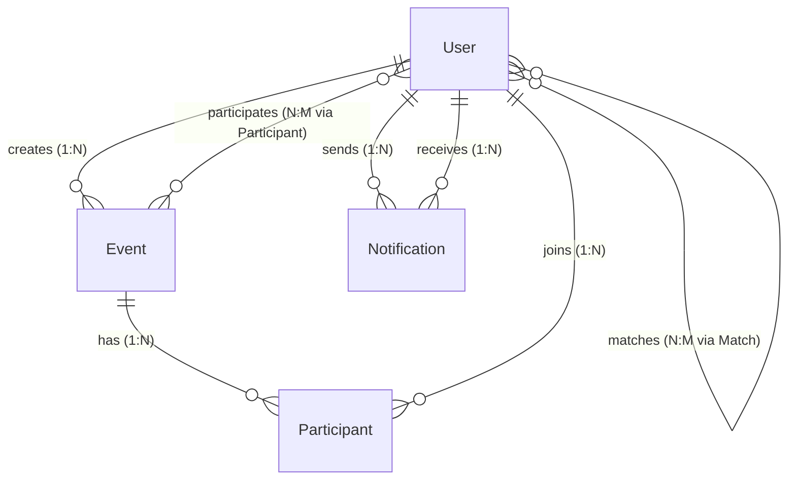

# ER-диаграмма Andex Events (Mermaid)

## Полная ER-диаграмма базы данных



## Упрощенная диаграмма (только связи)



## Диаграмма по модулям

### Модуль пользователей



### Модуль событий



### Модуль матчинга



### Модуль уведомлений



## Диаграмма с кардинальностью



## Как использовать

### 1. В GitHub
Просто вставьте код Mermaid в файл `.md` - GitHub автоматически отрендерит диаграмму.

### 2. В VS Code
Установите расширение: `Markdown Preview Mermaid Support`

### 3. Онлайн редактор
Используйте https://mermaid.live для редактирования и экспорта в PNG/SVG

### 4. В документации
```markdown
# Моя документация

## ER-диаграмма

\```mermaid
erDiagram
    User ||--o{ Event : creates
    ...
\```
```

## Легенда символов

### Кардинальность связей:
- `||--o{` - один к многим (1:N)
- `}o--o{` - многие ко многим (N:M)
- `||--||` - один к одному (1:1)
- `}o--||` - многие к одному (N:1)

### Типы полей:
- `PK` - Primary Key (первичный ключ)
- `FK` - Foreign Key (внешний ключ)
- `UK` - Unique Key (уникальный ключ)

### Типы данных:
- `uuid` - UUID
- `string` - VARCHAR/TEXT
- `text` - TEXT
- `int` - INTEGER
- `float` - FLOAT/DOUBLE
- `decimal` - DECIMAL
- `boolean` - BOOLEAN
- `timestamp` - TIMESTAMP
- `enum` - ENUM тип
- `jsonb` - JSONB (PostgreSQL)
- `geography` - PostGIS Geography

## Экспорт диаграммы

### В PNG (через mermaid.live):
1. Откройте https://mermaid.live
2. Вставьте код Mermaid
3. Нажмите "Download PNG"

### В SVG (через mermaid-cli):
```bash
npm install -g @mermaid-js/mermaid-cli
mmdc -i er-diagram.mmd -o er-diagram.svg
```

### В PDF (через Pandoc):
```bash
pandoc er-diagram-mermaid.md -o er-diagram.pdf
```

## Примечания

### PostGIS Geography
`locationGeo` поле использует PostGIS тип `geography(Point, 4326)` для эффективных геопространственных запросов:
- ST_DWithin для поиска в радиусе
- ST_Distance для вычисления расстояния
- GIST индекс для оптимизации

### Триггеры
Автоматические триггеры в базе данных:
- `update_updated_at_column()` - обновление поля `updatedAt`
- `update_location_geo()` - генерация `locationGeo` из `latitude/longitude`
- `check_mutual_match()` - автоматическая установка `isMutual` в Match

### Каскадные удаления
- User → Event: CASCADE (удаление пользователя удаляет его события)
- User → Participant: CASCADE (удаление пользователя удаляет его участия)
- Event → Participant: CASCADE (удаление события удаляет участников)
- User → Match: CASCADE (удаление пользователя удаляет его матчи)
- User → Notification (receiver): CASCADE
- User → Notification (sender): SET NULL

## Дополнительные ресурсы

- **Mermaid документация:** https://mermaid.js.org/
- **ER диаграммы в Mermaid:** https://mermaid.js.org/syntax/entityRelationshipDiagram.html
- **Онлайн редактор:** https://mermaid.live
- **VS Code расширение:** Markdown Preview Mermaid Support

---

**Дата создания:** 2024-12-13  
**Версия:** 1.0  
**Проект:** Andex Events